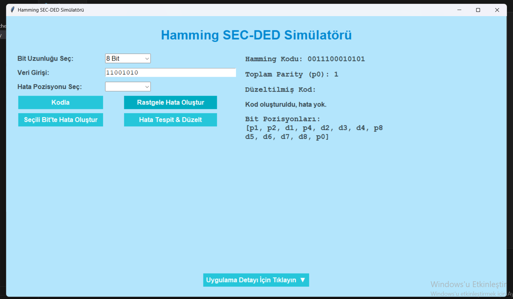
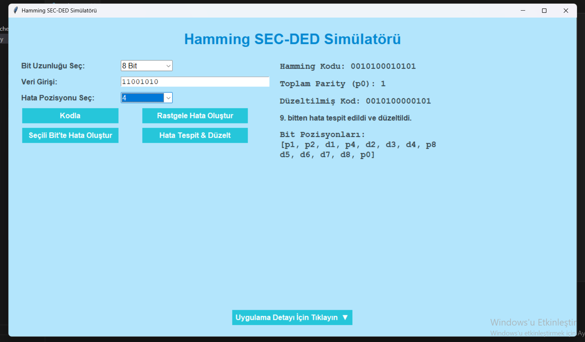

# 🧠 Hamming SEC-DED Simülatörü

Bu proje, **BLM230 Bilgisayar Mimarisi** dersi kapsamında geliştirilmiş bir **Hamming SEC-DED (Single Error Correction – Double Error Detection)** simülatörüdür. Python ve Tkinter kullanılarak geliştirilen bu uygulama, kullanıcıların 8, 16 veya 32 bitlik veri girişi yaparak Hamming kodu oluşturmasını, hata eklemesini ve bu hataları tespit edip düzeltmesini sağlar. Amaç, veri iletişiminde hata tespiti ve düzeltme süreçlerini kullanıcı dostu bir arayüzle görselleştirmektir.

## 🎯 Proje Amacı

- Kullanıcı dostu bir arayüzle Hamming kodunun nasıl çalıştığını göstermek
- Tek bitlik hataları düzeltebilmek ve çift bitlik hataları algılayabilmek
- Kullanıcının rastgele veya belirli bir pozisyonda hata ekleyerek hata düzeltme sürecini test etmesini sağlamak

## 🚀 Özellikler

- 8, 16 veya 32 bitlik ikili (binary) veri girişi
- Hamming kodu oluşturma (parite bitleri + genel parity biti p0)
- Hata Ekleme:
  - Rastgele bitte hata
  - Seçilen bitte hata
- Hata Tespiti ve Düzeltme:
  - Tek bitlik hataları düzeltir
  - Çift bitlik hataları algılar (düzeltemez)
- Tkinter tabanlı modern kullanıcı arayüzü:
  - Bit uzunluğu seçimi
  - Sadece 0/1 kabul eden veri girişi
  - Hamming kodu, genel parity, düzeltilmiş kod ve hata durumu etiketleri
  - Bit pozisyonlarını (p1, p2, d1, ...) gösteren dinamik alan
  - Açılır–kapanır açıklama paneli
- Tam ekran modda başlama

## ▶️ Kullanım

- Uygulama açıldığında ekran tam boy olur.
- Açılır menüden bit uzunluğu seçin (8 / 16 / 32 bit).
- Veri Girişi kutusuna sadece 0 ve 1’lerden oluşan veri girin. Uzunluk sınırlıdır.
- “Kodla” butonuna basın → Hamming kodu ve p0 hesaplanır.
- Hata eklemek istersen:
- “Rastgele Hata Oluştur” → kodun rastgele bir bitinde hata oluşturur
- “Seçili Bit'te Hata Oluştur” → menüden bit seçip bu bitte hata oluşturur
- “Hata Tespit & Düzelt” → varsa hata gösterilir ve tek bitlikse otomatik düzeltilir
- Açıklama paneli alt kısımda açılıp kapatılabilir.

  

## Demo Viedo
https://www.youtube.com/watch?v=MKnY9phU2dw

